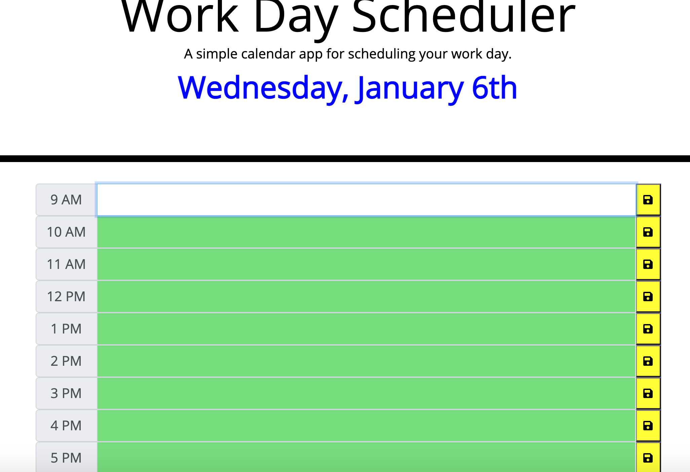
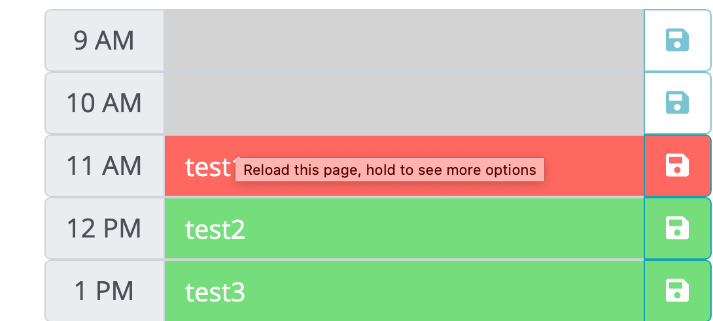

# WorkDay-Scheduler

***Description***

This website was designed to organize daily task during business hours between 9:00 am - 5:00 pm.


***Installation***

https://imanid-code.github.io/WorkDay-Scheduler/

***Usage***

This is the full daily planner. The day of the week, month and day of the month displayed at the top in blue. To the left  it has the hour. The to-do input section in the middle (the white and green backgrounds are). This is where you type what to do during that time block 

The yellow save button will save and store your input in both the section and the local storage of your computer. 



The Daily Planner is color cordinated by past (gray), present (red) and future (green). Only the input section will change colors. The time and save button remain the same. If the time has passed it will not allow you to input a to-do item.




***Technology***
```HTML```   ```CSS``` ```jQuerry``` ```Bootstrap``` ```moment```